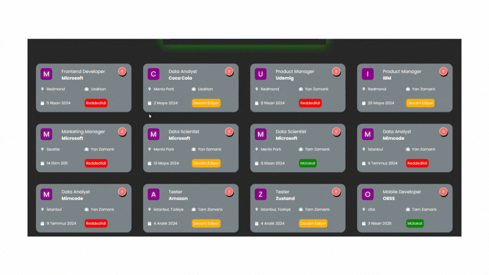

# REDUX-TOOLKIT-JOB-APP

<h4>

Proje Adı: Job App (İş Takip Uygulaması)
🚀 Proje Açıklaması
Job App, iş ilanlarını listeleyen, filtreleme ve sıralama seçenekleri sunan bir web uygulamasıdır. Kullanıcılar, iş ilanlarını belirli kriterlere göre arayabilir, sıralayabilir ve filtreleyebilir.

🔹 Projede Kullanılan Teknolojiler
React.js → Kullanıcı arayüzü oluşturuldu.

Redux Toolkit → Durum yönetimi için kullanıldı.

Axios → API istekleri için kullanıldı.

React Router → Sayfa yönlendirmeleri sağlandı.

Tailwind CSS → Modern ve şık bir arayüz oluşturuldu.

JSON Server → Sahte API oluşturularak backend işlemleri simüle edildi.

🎯 Özellikler
✅ İş ilanlarını listeleme: İş ilanları dinamik olarak API'den çekilir ve ekranda gösterilir.
✅ Arama fonksiyonu: Kullanıcılar belirli bir iş ilanını isme göre arayabilir.
✅ Filtreleme: İş türü (tam zamanlı, yarı zamanlı vb.) ve durumuna göre filtreleme yapılabilir.
✅ Sıralama: İş ilanları alfabetik veya tarihe göre sıralanabilir.
✅ State Yönetimi: Redux Toolkit ile global state yönetimi yapıldı.
✅ Responsive Tasarım: Mobil ve masaüstü uyumlu bir kullanıcı arayüzü sunar.

📌 Uygulama Akışı
1️⃣ Kullanıcı, "İş Listesi" sayfasına girer.
2️⃣ Tüm iş ilanları otomatik olarak ekrana gelir.
3️⃣ Kullanıcı, arama kutusuna belirli bir iş ismi yazarak arama yapabilir.
4️⃣ Filtreleme seçenekleri kullanılarak iş ilanları tür ve durumuna göre filtrelenebilir.
5️⃣ Sıralama seçeneği ile iş ilanları alfabetik veya tarihe göre sıralanabilir.
6️⃣ Kullanıcılar "İş Ekle" butonunu kullanarak yeni bir iş ilanı oluşturabilir.
7️⃣ Redux Toolkit, filtreleme ve sıralama işlemlerinin state yönetimini üstlenir.
8️⃣ Kullanıcı "Filtreleri Sıfırla" butonuna basarak tüm filtreleri kaldırabilir.

📸 Ekran Görüntüleri
Ana Sayfa (İş Listesi) → İş ilanlarının görüntülendiği sayfa.

Filtreleme Paneli → İş ilanlarını aramak, sıralamak ve filtrelemek için kullanılan form.

İş Ekleme Sayfası → Kullanıcıların yeni iş ilanı ekleyebildiği sayfa.

</h4>
<h5>Gif Dosyası :</h5>

